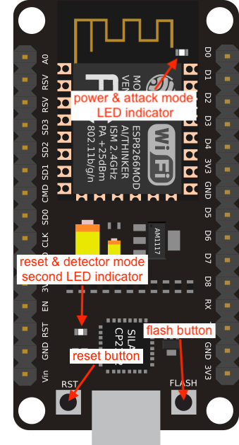

    
    <h2 align="center">Catch<b>ME</b></h2>
    
WiFi Fun Box

# FAQ
### Device Indicator (NodeMCU ESP12-E | CP210x)

|CP210x|
|:---:|
||

**Q: Only able to connect to Wi-Fi network on some devices**

A: This happens due to a channel conflict. Open up your browser and go to `http://192.168.4.1/settings` on a device that is able to connect to the **CatchME** network and change the Channel number from 1 to any number 1-14

**Q: SSID's wont load**

A: Try resetting the SSID list. Open up your browser and go to `http://192.168.4.1/settings`, click on <kbd>RESET</kbd> (Reset Saved SSIDs)

**Q: Deauth 0 pkts/s**

A: If you see 0 pkts/s on the **CatchME UI**, make sure your install the right version of ESP8266 board package (**it must be version 2.0.0!**)

**Q: Deauth attack wont work**

A: If it can send packets but your target doesn't lose its connection, then the WiFi router either uses `802.11w` and it's protected against such attacks

**Q: CatchME wont work**

A: Try to resetting the configuration to factory default by pressing `reset` button, press the `reset` button and then before 5 seconds *(or after the LED indicator blinks twice)* press again the `reset` button *(if you see the second LED indicator is blinking, it means your device is being reset)*

**Q: How I know if my device are booting up**

A: The power LED indicator will blinks twice *(it means your device is booting up normally)*