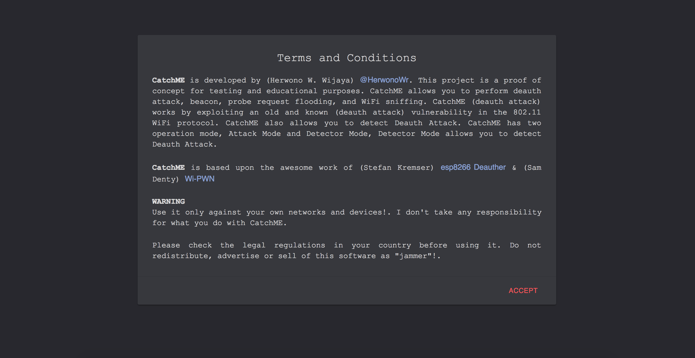
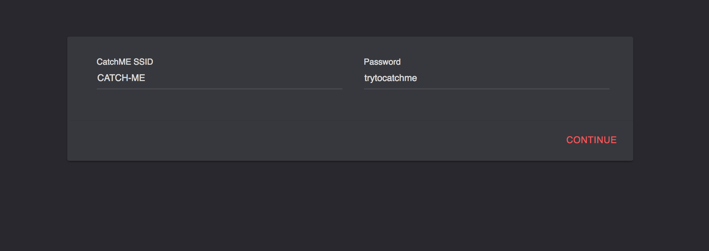
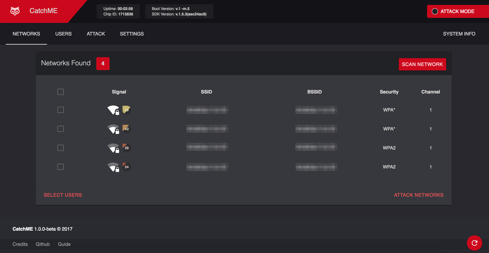
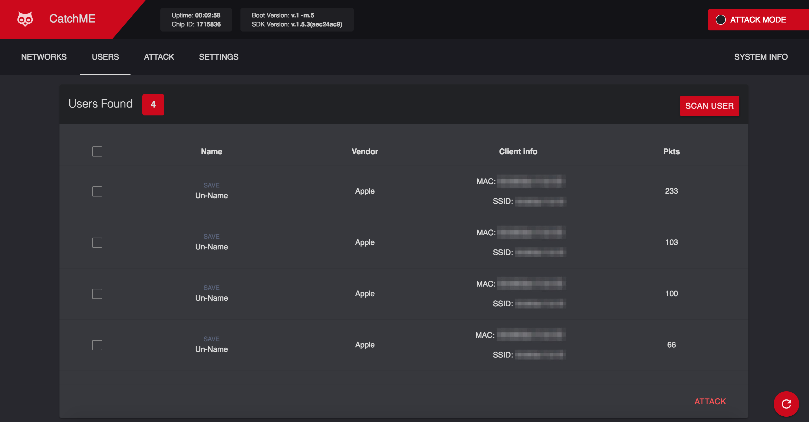
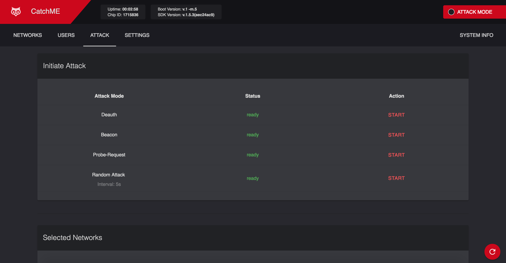
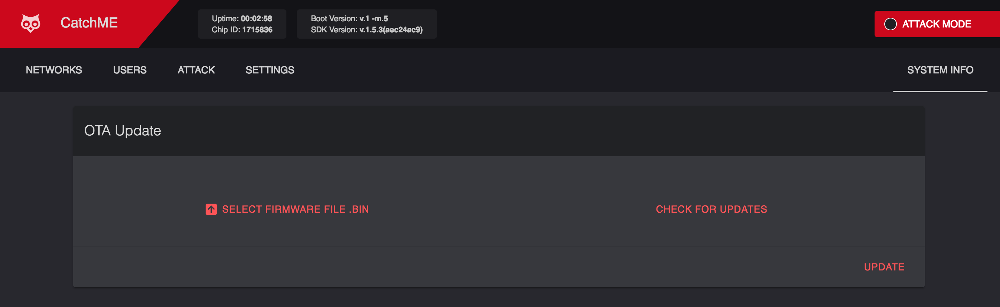

    
    <h2 align="center">Catch<b>ME</b></h2>
    
WiFi Fun Box

# Contents

 - [Getting Started](#getting-started)
 - [OTA Update](#ota-update)

 # Getting Started
 Quick start how to use CatchME

 1. Connect your ESP8622 to a USB power source (you can power it with an power banks)
 2. Scan for WiFi networks on your laptop or device, and connect to `CATCH-ME` SSID
 3. Once connected, open up your browser *(chrome is recommended)* go to `http://192.168.4.1`
 4. For the first time setup, click on <kbd>ACCEPT</kbd> to accept **Terms and Conditions**

    **Term and Conditions**

    

 5. Specify your SSID and password *(leave blank the password for open CatchME WiFi network)* to be used, and click on <kbd>CONTINUE</kbd>

    **Setup SSID and Password**

    

    **Setup Complete**

    

    **Note: Device will be restart to take effect**

 6. Reconnect to the new network using SSID and password you specified in the previous step
 7. Once reconnected, go back to your browser and reload the page or open `http://192.168.4.1` again if page doesn't reload
 8. As a default **CatchME** will be in the `Attack Mode`
 9. The `NETWORKS` page will be show up and automatically scan the networks or you can click on <kbd>SCAN NETWORK</kbd> for scanning the networks

    **Networks Scan**

    

    **Note: You may have to reconnect to the CatchME WiFi network**

 1. Select the WiFi network(s) you want to perform the attack on. Once finished, click on <kbd>SELECT USERS</kbd> if you want to attack specific user(s) or click on <kbd>ATTACK NETWORKS</kbd> if you want to attack all the users in the selected network(s)

    **Select Users**

    

 2. Select the attack you wish to perform *(such as Deauth Attack)* and click on <kbd>START</kbd> to start the attack

    **Attacks**

    

# OTA Update
1. [Download](https://github.com/HerwonoWr/CatchME/releases) the current firmware release (binary version)
2. Connect to your **CatchME** network
3. Open **CatchME UI** IP address from your browser
4. Go to `SYSTEM INFO` menu, and click `SELECT FIRMWARE FILE .BIN`

    **OTA Update**

    

5. Browse for the `.bin` file you just downloaded and click open
6. Click <kbd>UPDATE</kbd>