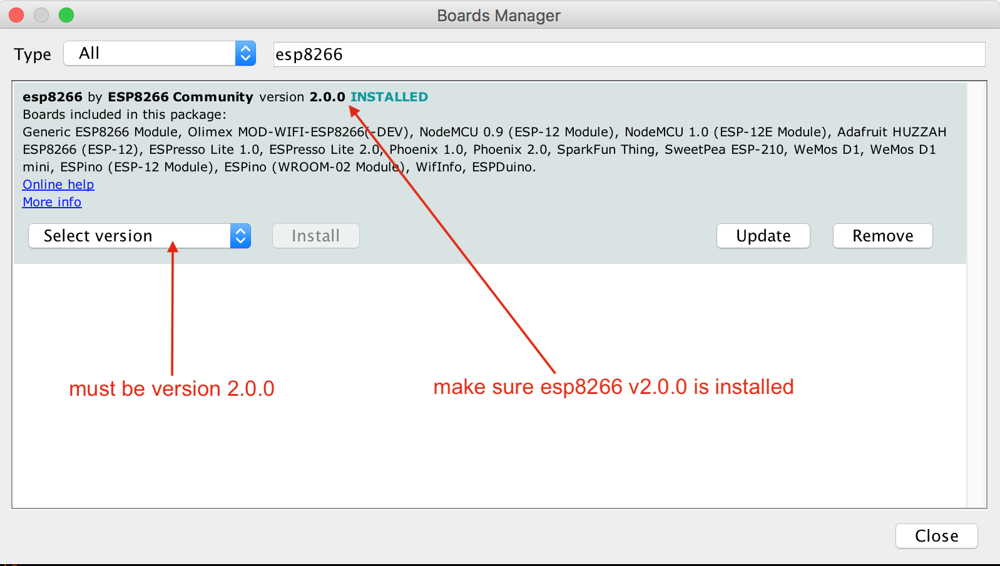

<p align="center">
    <a href="#">
        
    </a>
    <h2 align="center">Catch<b>ME</b></h2>
    <p align="center">WiFi Fun Box</p>
    <p align="center">
        <a href="#">
            
        </a>
        <a href="https://github.com/HerwonoWr/CatchME/issues">
            
        </a>
        <a href="#">
            
        </a>
        <a href="#">
            
        </a>
        <a href="#">
            
        </a>
        <a href="#">
            
        </a>
        <a href="#">
            
        </a>
    </p>
<p>

# Contents

 - [Introduction](#catchme-introduction)
 - [Features](#features)
 - [Installing and Updating Options](#installing-and-updating)
     - [Using NodeMCU Flasher](#using-nodemcu-flasher)
	 - [Using Arduino IDE](#using-arduino-ide)
	 - [Using CatchME UI](#using-catchme-ui)
 - [Documentation](#documentation)
 - [Issues](#issues)
 - [Contributing](#contributing)
 - [Code of Conduct](#code-of-conduct)
 - [License and Credits](#license-and-credits)

# CatchME Introduction

**CatchME** is developed by **(Herwono W. Wijaya)** [@HerwonoWr](https://twitter.com/HerwonoWr), this project based upon the awesome work of (Stefan Kremser) [@spacehuhn](https://github.com/spacehuhn), (Sam Denty) [@samdenty99](https://github.com/samdenty99), and other [contributors](#credits). This project is a proof of concept for testing and educational purposes.

CatchME allows you to perform deauth attack, beacon, probe request flooding, and WiFi sniffing. CatchME (deauth attack) works by exploiting an old and known (deauth attack) vulnerability in the 802.11 WiFi protocol. CatchME also allows you to detect Deauth Attack.

**CatchME** has two operation mode, **Attack Mode** and **Detector Mode**, Detector Mode allows you to detect Deauth Attack.

**WARNING**

Use it only against your own networks and devices!. I don't take any responsibility for what you do with CatchME.

Please check the legal regulations in your country before using it. Do not redistribute, advertise or sell of this software as **"jammer"**!.

# Features
- Fully web based UI management
- WiFi client mode - access CatchME on the WiFi network
- Deauth attack, beacon, probe request flooding, and WiFi sniffing
- Attack mode and detector mode for deauth attack
- ESP8266 system info
- Double reset press button - factory default configurations
- Flash button - attack mode
- OTA update

# Installing and Updating
In order to install the firmware, you can use one of the following installation methods. Using **NodeMCU Flasher** or **Arduino IDE**, and for updating the firmware, you can use either **NodeMCU Flasher**, **Arduino IDE**, and **CatchME UI**. The **NodeMCU Flasher** method is easier overall but using **Arduino IDE** is better for debugging.

For the first time firmware installation, use **NodeMCU Flasher** or **Arduino IDE**. **CatchME UI** method is only can be use for updating the firmware.

**YOU ONLY NEED TO DO ONE OF THE INSTALLATION METHODS!**

#### Requirements
- ESP8266 Module
- ESP8266 Core library, must be version 2.0.0!
- ESP8266 Patch library
- ESP8266 Driver
    - Windows Users

        |CP210x|CH34x|
        |:---:|:---:|
        |[Download](Tools/drivers/CP210x.zip)|[Download](Tools/drivers/CH34x.zip)|
    - MacOS Users
        
        For the MacOS you can install driver using `brew`
        ```
        brew tap caskroom/drivers
        brew cask install silicon-labs-vcp-driver
        ```

ESP8266 board variants:

|CP210x|CH34x|
|:---:|:---:|
|||

### Using NodeMCU Flasher
1. [Download](https://github.com/nodemcu/nodemcu-flasher/raw/master/Win64/Release/ESP8266Flasher.exe) **NodeMCU Flasher**
2. [Download](https://github.com/HerwonoWr/CatchME/releases) the current firmware release (binary version)
3. Upload the firmware `.bin` file using **NodeMCU Flasher**
4. Connect your ESP8266 (making sure the correct drivers are installed) and open up the **NodeMCU Flasher**
5. Go to the `Advanced` tab and select the correct values for your board
6. Navigate to the `config` tab and click the gear icon for the first entry
7. Browse for the `.bin` file you just downloaded and click open
8. Switch back to the `Operation` tab and click <kbd>Flash(F)</kbd>

*Note: This guide is for Windows users*

### Using Arduino IDE
1. [Download](https://www.arduino.cc/en/Main/Software) and install **Arduino IDE**
2. [Download](https://github.com/HerwonoWr/CatchME/releases) the current firmware release (source version)
3. MacOS Users
    - Go to `Arduino` > `Preferences`
    - Add `http://arduino.esp8266.com/stable/package_esp8266com_index.json` to the **Additional Boards Manager URLs**
4. Windows Users
    - Go to `File` > `Preferences`
    - Add `http://arduino.esp8266.com/stable/package_esp8266com_index.json` to the **Additional Boards Manager URLs**
5. Go to `Tools` > `Board` > `Boards Manager`
6. Type in `esp8266`
7. Select version `2.0.0` and click on `Install` (**must be version 2.0.0!**)

8. Patching ESP8266 v2.0.0 Core
    - Check your ESP8266 packages location
        - MacOS Users
            - Go to `Arduino` > `Preferences`

                Find your packages path location under text `More preferences can be edited directly in the file`
        - Windows Users
            - Go to `File` > `Preferences`

                Find your packages path location under text `More preferences can be edited directly in the file`
9. Copy patch files in the **esp8266-Patch** folder to the following locations

    |Patch File|Path Location|Folder|
    |---|---|:---:|
    |user_interface.h|[packages-location]`/packages/esp8266/hardware/esp8266/2.0.0/tools/sdk/include`|`include`|
    |ESP8266WiFi.cpp<br>ESP8266WiFi.h|[packages-location]`/packages/esp8266/hardware/esp8266/2.0.0/libraries/ESP8266WiFi/src`|`src`|
    |ESP8266HTTPUpdateServer.cpp|[packages-location]`/packages/esp8266/hardware/esp8266/2.0.0/libraries/ESP8266HTTPUpdateServer/src`|`src`|
10. Go to `CatchME` folder, and open `CatchME.ino` file in **Arduino IDE**
11. Select your ESP8266 board module *(this guide using NodeMCU 1.0 (ESP12-E Module))* and the right port
    - Go to `Tools` > `Board`, select the right board module
    - Go to `Tools` > `Port`, select the right port
12. Depending on your ESP8266 board, you may have to adjust the board configurations
    - Here is an example board configuration for *NodeMCU 1.0 (ESP12-E Module)*

        |Conf|Value|
        |---|---|
        |CPU Frequency|80Mhz|
        |Flash Size| 4M (3M SPIFFS)|
        |Upload Speed|115200|
13. Click <kbd>Upload</kbd>

*Note: This guide is for MacOS and Windows users*

### Using CatchME UI
CatchME UI method only for updating the firmware, this method can't be use for first time installation.
1. [Download](https://github.com/HerwonoWr/CatchME/releases) the current firmware release (binary version)
2. Connect to your **CatchME** network
3. Open **CatchME UI** IP address from your browser
4. Go to `SYSTEM INFO` menu, and click `SELECT FIRMWARE FILE .BIN`

5. Browse for the `.bin` file you just downloaded and click open
6. Click <kbd>UPDATE</kbd>

# Documentation

- [Getting started with CatchME](Docs/MANUAL.md)
- [FAQ](Docs/FAQ.md)

# Issues
If you encounter an issue, you are welcome to submit it [here.](https://github.com/HerwonoWr/CatchME/issues)

Please provide as much context as possible:

- ESP8266 Arduino core version which you are using.
- Your sketch code; please wrap it into a code block, see [Github markdown manual.](https://help.github.com/articles/basic-writing-and-formatting-syntax/#quoting-code)
- For issues which happen at compile time, enable verbose compiler output in the IDE preferences, and attach that output (also inside a code block).
- ESP8266 development board model.
- IDE settings (board choich, flash size).

# Contributing
Please check [**Contributing Guidelines**](CONTRIBUTING.md) to understand some basic conventions for contributing to this project.

#### General
Please make sure there are no existing pull requests to address the mentioned new features or issues. And, please check for issues related to the update, as someone else may be working on the issue.

# Code of Conduct
Please check [**CODE OF CONDUCT**](CODE_OF_CONDUCT.md) to understand CatchME contributor covenant Code of Conduct.

# License and Credits
**CatchME** is developed and maintained by (Herwono W. Wijaya) [@HerwonoWr](https://twitter.com/HerwonoWr). This project is [licensed under MIT License.](LICENSE)

**ESP8266 deauther** and **DeauthDetector** written by (Stefan Kremser) is used in this project. It is distributed under MIT license.

**Wi-PWN** written by (Sam Denty) is used in this project. It is distributed under CC BY-NC 4.0.

### Credits
Thanks for the awesome works:
- (Stefan Kremser) [@spacehuhn](https://github.com/spacehuhn/esp8266_deauther)
- (Sam Denty) [@samdenty99](https://github.com/samdenty99)
- (Aur &eacute;lien Hernandez) [@N0vaPixel](https://github.com/N0vaPixel)
- (SaltyViper) [@SaltyViper](https://github.com/SaltyViper)
- (Tobozo) [@tobozo](https://github.com/tobozo)
- (Larz Jacobs) [@LarzJ](https://github.com/LarzJ)
- (Stimons) [@StijnSimons](https://github.com/StijnSimons)
- (Andrbmgi) [@andrbmgi](https://github.com/andrbmgi)
- (Samuel KS) [@SamuelKlit](https://github.com/SamuelKlit)
- (Helmut) [@schinfo](https://github.com/schinfo)
- (Erick Belluci Tedeschi) [@ericktedeschi](https://github.com/ericktedeschi)
- (Antonio Navarro Perez) [@ajnavarro](https://github.com/ajnavarro)

### Thanks to
- (MAC Address List) - [Wireshark manufacturer database](https://www.wireshark.org/tools/oui-lookup.html)
- (Wave.js) - [Click effect inspired by Google's Material Design](https://github.com/fians/Waves)
- (Material Design Icons) - [Icons assets](https://github.com/fians/Waves)